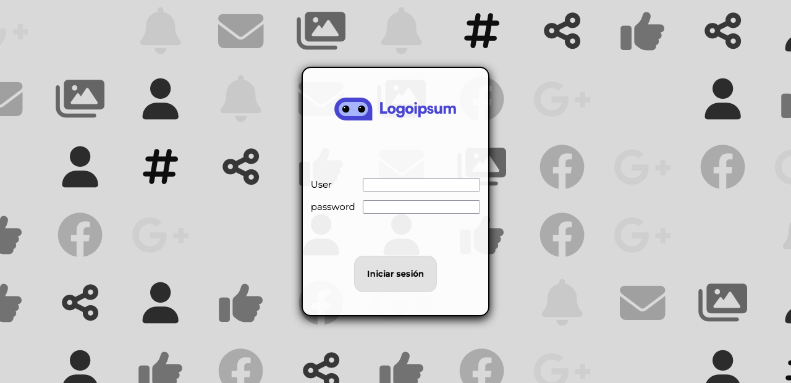

# Login con un fondo en movimiento, relación con redes sociales
___

## Descripción
Practicando el grid, flex, keyframes y position, he conseguido crear un layout de login con algo de animación. Para realizarlo he realizado las siguientes acciones:
 + Creado un div con position relative, dentro del cual irán los iconos.
 + Dar a dicho `div` un `display: grid`, con un número de columnas determinado y un `grid-template-rows: auto`.
 + Añadidos los iconos de Font Awesome dentro del grid, centrarlos con flex y darles un tamaño adecuado.
 + Poner el grid con un `widht: 100vw` y un `height: 100vh`.
 + animar las imágenes, dandoles opacidad y escalando su tamaño.
 + Crear un `div`para el login, darle `position: absolute` respecto al grid y añadirle ancho y alto del 100%, para así poder alinear el login dentro del viewport.
 + dentro de dicho `div`, crear la carta del login.
 + realizar otro grid dentro del login, esta vez en vez de con columnas, con lineas, y posicionar los elementos con flex, cada uno dentro de su propio `div`.
 ___
 
 ## Screenshots y pequeño video:
 
 
